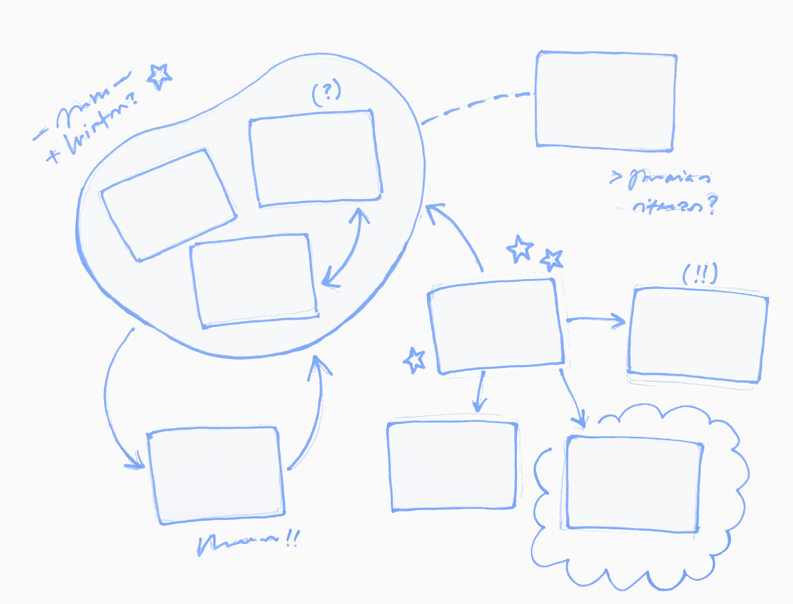

# Systems Card Game

<p align="center">
  
  <br>
  <small>Logo by Irina Wang</small>
</p>

The Systems Card Game is a participatory tool for mapping and exploring operational systems, such as livelihoods, communities, and occupations.

Participants use cards to identify important elements of a system, arrange them into a shared map, and explore the relationships between them. The resulting map can be used to examine external pressures, disruptions, possible responses, and desired futures.

## Project website

Visit the [Systems Card Game website](https://hmatthes.github.io/systems-card-game/) for:

* an introduction to the method;
* guidance on using the tool;
* editable and printable card templates;
* adapted card sets;
* reports from workshops and courses.

## Repository contents

The public website and its downloadable materials are stored in the [`docs`](docs/) folder.

```text
docs/
├── index.md             Website homepage
├── about.md             Concept and development of the method
├── how-to-use.md        General instructions
├── downloads/           Generic templates, guidance, and templates to document your adaptations/workshops
├── applications/        Adapted card sets and workshop reports
└── assets/              Images used on the website
```

## Adaptations and documented uses

An **adaptation** is a version of the card set developed for a particular system or purpose.

A **workshop or course report** documents a specific occasion on which an adapted set was used. One adaptation may therefore be associated with several workshop or course reports.

Current examples include adaptations for reindeer-herding livelihoods and Greenlandic community livelihoods.

## Development

The Systems Card Game developed from *Playing with Dreams*, an initial participatory workshop format for mapping livelihoods, exploring disruptions, and articulating desired futures. The method has since been generalized so that it can be adapted to different systems, questions, and participatory settings.


