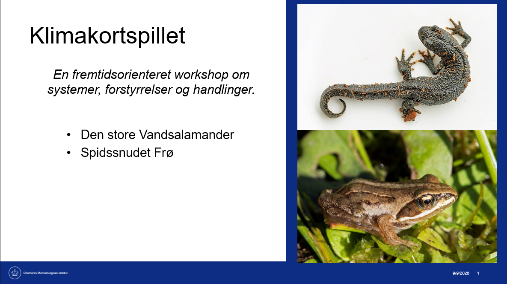

# Operational environment for being a frog

This adaption was developed to make the kids reflect on system interconnections (environmental and climate related) especially their everyday life and surroundings at their local community. Purpose was to make kids aware of their own effect and response on their surroundings. To make them map connections and find interconnections they were not aware of. Furthermore to let then exploring how these mapped systems respond to climate-driven changes.

<figure style="margin: 1.5rem 0;">

  

    

    

  

  <figcaption style="margin-top: 0.75rem;">
    <small>
      The climate card game: A future-oriented workshop on systems, disturbances and actions. Starring, the salamander and the frog. Image by Anette Ester Dissing (DMI)
    </small>
  </figcaption>

</figure>

## About this adaptation

## Download the card set

| Language | Printable card set |
|---|---|
| Danish | [Download cards](materials/Klimakortspil_DK_spillekort.docx) |

## Workshops using this adaptation

| Workshop | Preview |
|---|---|
| **[Workshop with students from a Danish lower secondary school](workshops/Danish-secondary-school/)**  A participatory workshop aiming to make the kids reflect on system interconnections (environmental and climate related) especially their everyday life and surroundings at their local community. | <a href=</a> |

| **[Workshop with students from a Danish lower secondary school](workshops/Danish-secondary-school/)**  A participatory workshop aiming to make the children reflect on environmental and climate-related system interconnections in their everyday lives and local community. |  |