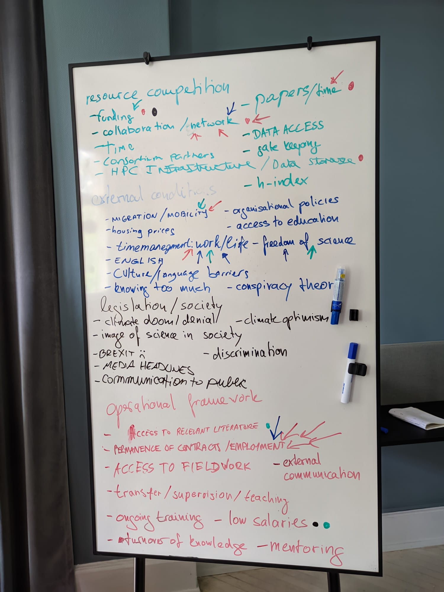

# Workshop at the PolarRES ECR Bootcamp, Søminestationen, Holbæk, Denmark

[Back to Operational environment of being a scientist]({{ site.baseurl }}/applications/being-a-scientist/)

  
   
  <small>System entries and most critical system componenets created during the mapping workshop at the PolarRES ECR Bootcamp. Photo by Oskar Landgren.</small>

The workshop at the PolarRES ECR Bootcamp was a participatory pilot exploring how the systems card game can be adapted to livelihoods that are not environment dependend. Participants first created entries for different categories of cards, marking which componenets of the system could be in multiple categories. Then they pointed out which parts of the system they considered most critical for being successful as a scientist.

| Workshop information | |
|---|---|
| **Date** | July 2023 |
| **Location** | Holbæk, Denmark |
| **Context** | PolarRES Early Career Researcher's Bootcamp |
| **Duration** | Approximately 1.5 hours |
| **Participants** | approximately 15 ECRs |
| **Format** | round-the-table |
| **Language** | English |

[Read the full workshop documentation](report.md){: .btn .btn-primary }

## Card set

The workshop used the **Operational environment for being a scientist** card set. Its system cards represent Conditions for participation in science, Rules and recognition, Scientific work practice, and Competition and Access.

[View the adaptation and download the cards]({{ site.baseurl }}/applications/being-a-scientist/){: .btn }