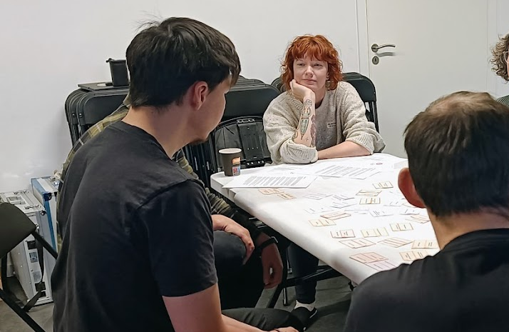

# Climate-resilient futures at the Ilulissat Science Forum 2025

[Back to Ilulissat Livelihoods and Climate Futures]({{ site.baseurl }}/applications/ilulissat-livelihoods/)

  
   
  <small>Participants mapping community livelihoods and climate resilience during the workshop.</small>

This participatory workshop brought local residents and visiting polar researchers together to explore livelihoods, community connections and climate resilience in Ilulissat.

Participants created shared maps of the community system, explored how climate-related disruptions could affect its connections, and discussed preparedness, adaptation and desirable futures.

| Workshop information | |
|---|---|
| **Date** | 9 November 2025 |
| **Location** | ILLU Science and Art Centre, Ilulissat, Greenland |
| **Context** | Ilulissat Science Forum 2025 |
| **Participants** | Local residents and visiting polar researchers |
| **Format** | Facilitated collaborative systems mapping |
| **Languages** | English and Kalaallisut |
| **Focus** | Community livelihoods and climate resilience |

[Read the full workshop documentation](report.md){: .btn .btn-primary }

## Card set

The workshop used the **Ilulissat Livelihoods and Climate Futures** card set. Its system cards represent livelihood and community, climate and environment, infrastructure, and society, economy and governance.

English and Kalaallisut versions were combined for bilingual use during the workshop.

[View the adaptation and download the cards]({{ site.baseurl }}/applications/ilulissat-livelihoods/){: .btn }

<!--
Add links to photographs, reports, maps or other workshop outputs here
if they become available.
-->