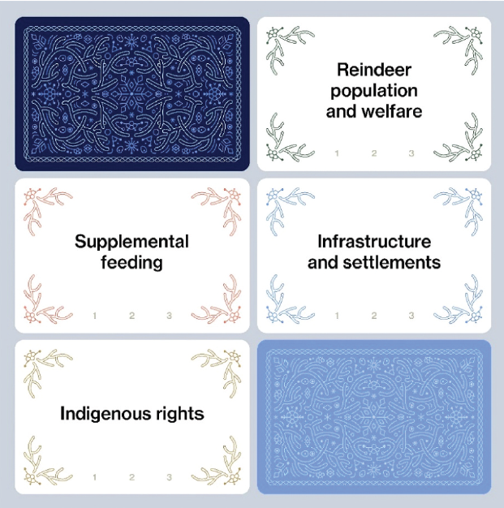
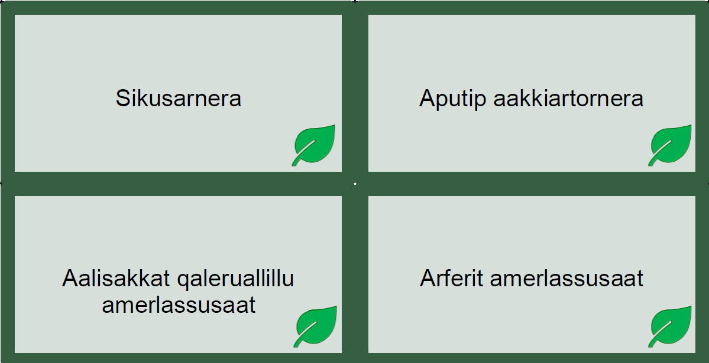
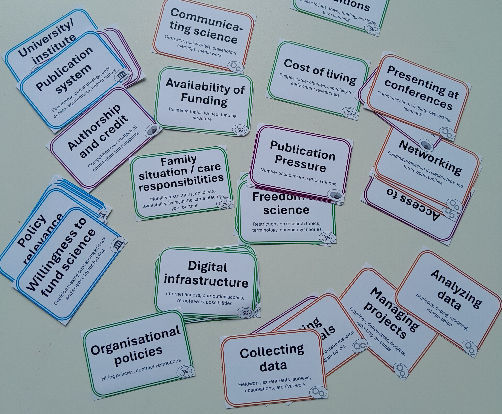

# Adaptations and workshops

The Systems Card Game can be adapted to different systems, questions, and groups of participants.

This section distinguishes between two kinds of examples:

## Adapted card sets

An adaptation is a version of the tool developed for a particular system or purpose. Its page describes the system, the card categories, the choices made during adaptation, and the available materials.

## Workshop and course reports

A workshop or course report documents a particular use of an adapted card set. It describes the participants, format, facilitation process, and outcomes.

One adaptation may be used in several workshops or courses. Reports of those uses are therefore grouped with the relevant adaptation.

## Selected adaptations

| Adaptation | Preview |
|---|---|
| **[Reindeer Husbandry Operational Environment](reindeer-herding/)**  A multilingual card set for mapping reindeer husbandry as a livelihood system and exploring environmental, social, economic, and political change. |  |
| **[Greenland/Ilulissat Livelihoods](ilulissat-livelihoods/)**  A bilingual card set for mapping livelihoods in Greenland/Ilulissat and exploring climate futures. |  |
| **[Operational Environment For Being A Scientist](being-a-scientist/)**  A card set in English for mapping operational environment in which scientists work. |  |

More adaptations and documented applications will be added as they become available.