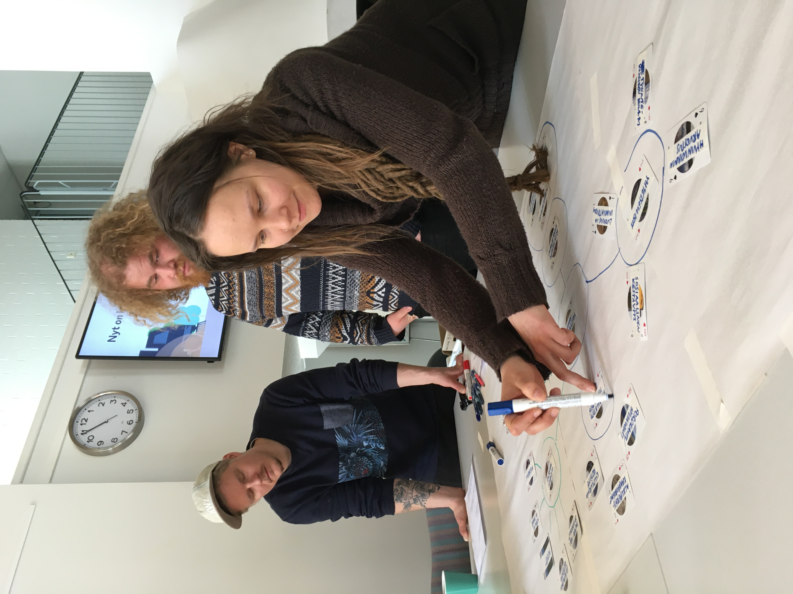

# Operational Environment of Nature Tourism

This adaptation of the Systems Card Game was developed to support education and to provide means to explore a complex system with students. The aim was to help to understand the diversity of and linkages within the operational environment of nature tourism, and to help to discuss the impacts of climate change on this business. 

  
   
  <small>Operational environment of nature tourism, built together with students of the Sámi Educational Institute SOGSAKK, in Inari, northern Finland, May 2022.</small>

## About this adaptation

The prepared card set helps participants identify, arrange, connect, and discuss important elements of nature tourism, using elements from five categories: “Business”, “Environment and climate”, “Economy, markets, society, governance”, “Land use”, “Tourists”.

[Read the full adaptation documentation]({{ site.baseurl }}/applications/nature-tourism/adaptation/){: .btn .btn-primary }

## Download the card set

| Language | List of card elements |
|---|---|
| English | [Download list](materials/Operational_environment_nature_tourism_list_of_elements_FINNISH.xlsx) |

## Workshops using this adaptation

| Workshop | Preview |
|---|---|
| **[Workshop with students of nature tourism, at Sámi Education Institute in Inari, northern Finland (4.5.2022). ](workshops/Sami-Education-Institute/)**  An educational workshop mapping the operational environment of nature tourism and the impacts of climate change. |  |