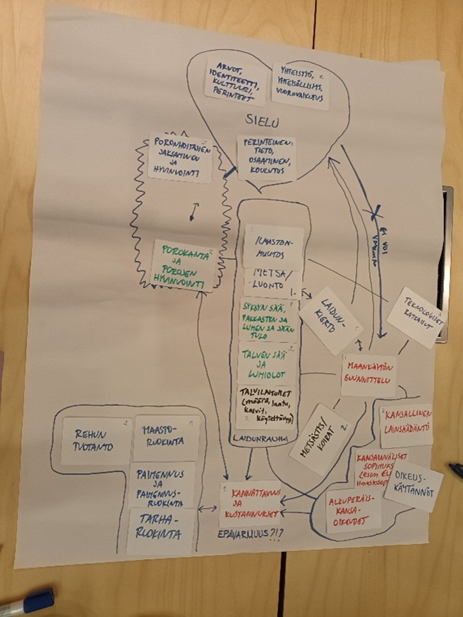
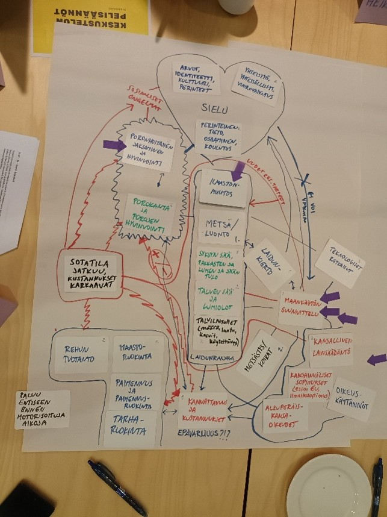
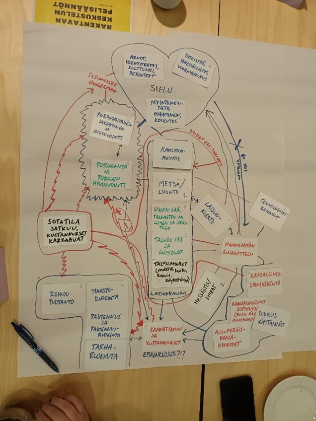

# Surprises and Dreams: Reindeer and Fish Research Days, Inari

[Back to Reindeer Husbandry Operational Environment]({{ site.baseurl }}/applications/reindeer-herding/)

<figure style="margin: 1.5rem 0;">

  

    

    

    

  

  <figcaption style="margin-top: 0.75rem;">
    <small>
      Example of the operational environment built in the workshop, after the first, the second, and the third session. Photos: Ilona Mettiäinen.
    </small>
  </figcaption>

</figure>

*Surprises and Dreams* was a participatory workshop exploring the operational environment and possible futures of reindeer husbandry.

Participants first created shared maps of the livelihood system. They then explored how global drivers and unexpected developments could affect those systems before identifying elements of desired futures and possible pathways towards them.

| Workshop information | |
|---|---|
| **Date** | 25 August 2022 |
| **Location** | Inari, northern Finland |
| **Context** | Reindeer and Fish Research Days |
| **Duration** | Approximately 3.5 hours |
| **Participants** | 36 people, including nine organisers |
| **Format** | Four facilitated subgroups |
| **Language** | Finnish |

[Read the full workshop documentation](report.md){: .btn .btn-primary }

## Workshop reports

A detailed report is available in Finnish, together with an English summary.

[Download the Finnish workshop report](Porotalouden_tulevaisuus_tyopaja_-Inari_raportti_221222_valmis.pdf){: .btn }

[Download the English workshop summary](Reindeer-husbandry-dreams-and-surprises-report.pdf){: .btn }