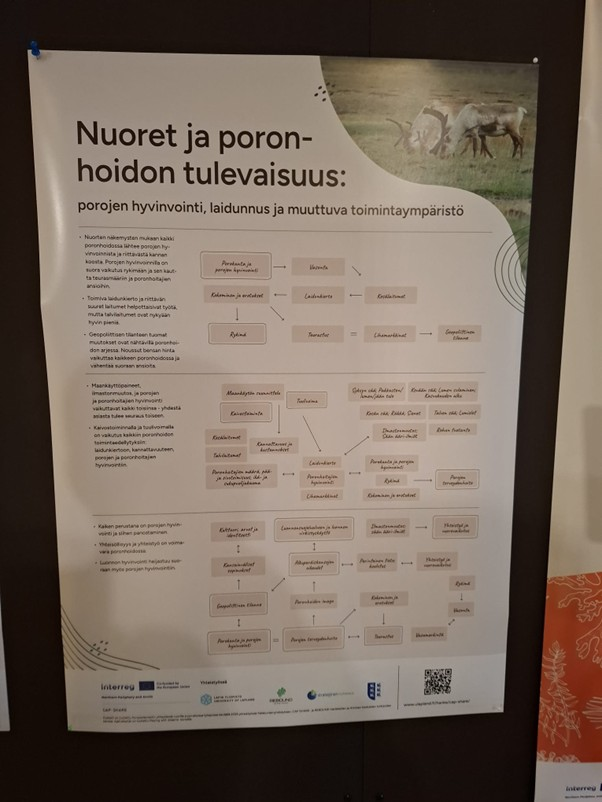

# Surprises and Dreams: Reindeer and Fish Research Days, Inari

[Back to Reindeer Husbandry Operational Environment]({{ site.baseurl }}/applications/reindeer-herding/)

  
   
  <small>A system map created during the workshop.</small>

Three small workshops in Inari, Sodankylä and Sattanen explored young herders’ perspectives on the present and future of reindeer husbandry. The cards helped participants identify important topics and develop messages that were later presented at the Finnish Reindeer Parliament.

| Workshop information | |
|---|---|
| **Date** | May 2026 |
| **Location** | Inari, Sodankylä and Sattanen, northern Finland |
| **Context** | workshop need raised by Reindeer Herders' Association |
| **Duration** |  |
| **Participants** |  |
| **Format** | three facilitated workshops |
| **Language** | Finnish |

[Read the full workshop documentation](report.md){: .btn .btn-primary }

## Workshop reports

not available yet