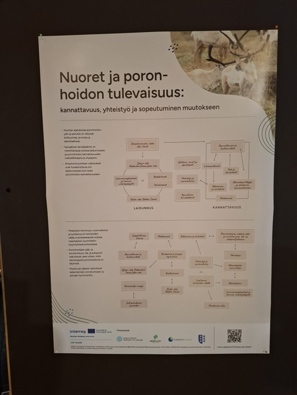

# Young People in Reindeer Husbandry: Workshop Series in Inari, Sodankylä and Sattanen

[Back to Reindeer Husbandry Operational Environment]({{ site.baseurl }}/applications/reindeer-herding/)

<figure style="margin: 1.5rem 0;">

  

    

    

  

  <figcaption style="margin-top: 0.75rem;">
    <small>
      Two posters produced basing on the workshop discussions, and on mind-maps built, using the cards, in the workshop.
    </small>
  </figcaption>

</figure>

Three small workshops in Inari, Sodankylä and Sattanen explored young herders’ perspectives on the present and future of reindeer husbandry. The cards helped participants identify important topics and develop messages that were later presented at the Finnish Reindeer Parliament.

| Workshop information | |
|---|---|
| **Date** | May 2026 |
| **Location** | Inari, Sodankylä and Sattanen, northern Finland |
| **Context** | workshop need raised by Reindeer Herders' Association |
| **Duration** |  |
| **Participants** | young reindeer herders (ages below 15 to over 30) from several herding districts |
| **Format** | three facilitated workshops |
| **Language** | Finnish |

[Read the full workshop documentation](report.md){: .btn .btn-primary }

## Card set

The workshop used the ** Reindeer Husbandry Operational Environment** card set. Its system cards represent Pastures and land use; Reindeer herding and herders; Climate, the natural environment, and reindeer as animals; and Economy, markets, society, and governance.

[View the adaptation and download the cards]({{ site.baseurl }}/applications/reindeer-herding/){: .btn }

## Workshop reports

No further detailed workshop reports are available. 