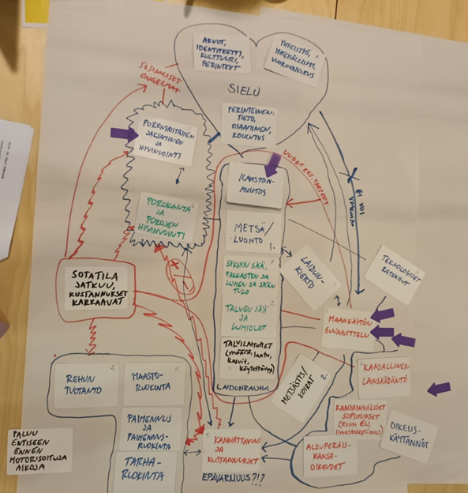

# Reindeer herding in northern Fennoscandia

This application of the systems card game was carried out with reindeer
herders in northern Fennoscandia. It explores how climate change interacts
with snow conditions, grazing areas, infrastructure, and policy.

For full materials, see the example folder on GitHub:
https://github.com/hmatthes/systems-card-game/tree/main/application-examples/reindeer-herding
